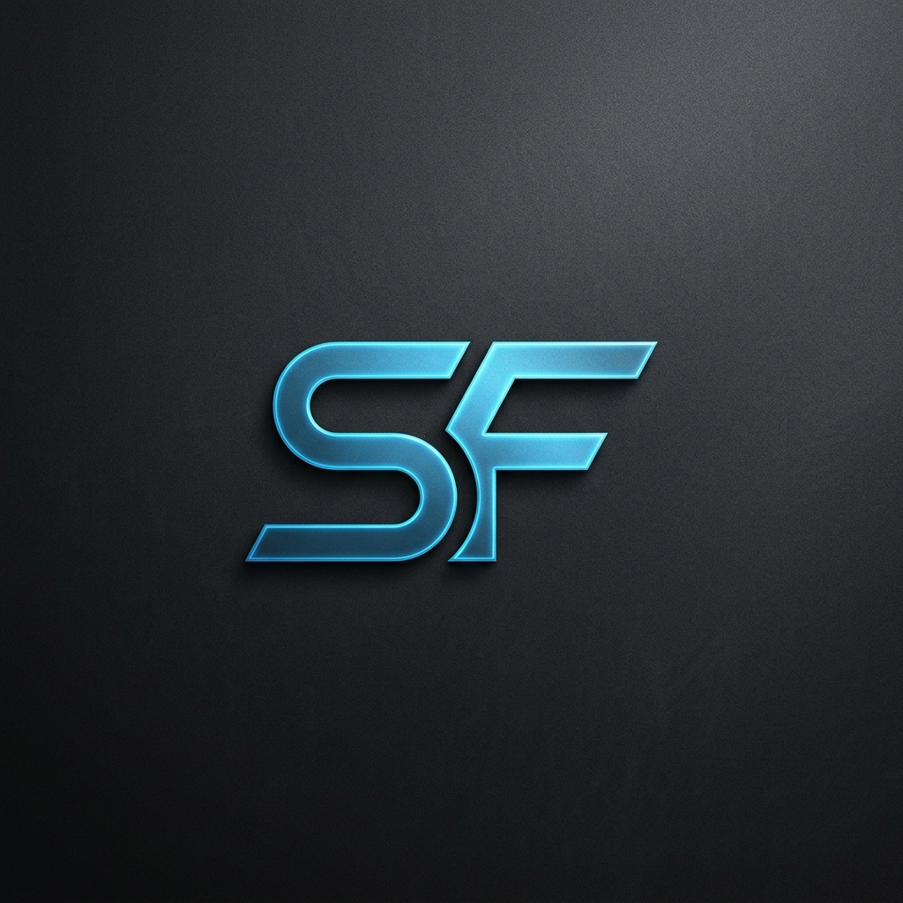

# Saif Alfeshawy | Engineering Portfolio

A high-performance, minimalist personal portfolio designed with a focus on clean engineering aesthetics and interactive user experience. This project showcases my journey as a Computer Science & AI student, highlighting my work in C++, algorithms, and automation.

<p align="center">
  
</p>

## 🚀 Overview

This portfolio is built to reflect a "Graphite" aesthetic—minimalist, dark-themed, and technically grounded. It moves away from flashy buzzwords to focus on real engineering milestones, modular code, and practical implementation.

### Key Features
- **Interactive Terminal:** A custom-built CLI simulation that allows users to interact with my background and skills through commands.
- **Dynamic Particle System:** A "Spider Constellation" canvas background with mouse-attraction physics, built for high-performance visual engagement.
- **Engineering Timeline:** A vertical progression of my academic journey at Helwan University, ICPC training, and tech community involvement.
- **Project Showcase:** Detailed cards for my C++ systems, focusing on algorithmic efficiency and modular design.
- **Fully Responsive:** Optimized for everything from mobile screens to high-resolution desktops.

## 🛠 Tech Stack

- **Framework:** [React](https://reactjs.org/) + [Vite](https://vitejs.dev/) (for lightning-fast HMR and build performance)
- **Styling:** [Tailwind CSS v4](https://tailwindcss.com/) (Modern, utility-first CSS)
- **Animations:** [Framer Motion](https://www.framer.com/motion/) (For smooth transitions and micro-interactions)
- **Icons:** [Lucide React](https://lucide.dev/) (Clean, consistent iconography)
- **Deployment:** [GitHub Pages](https://pages.github.com/)

## 📂 Project Structure

```text
Portfolio/
├── src/
│   ├── components/       # Modular UI components (Hero, Terminal, etc.)
│   ├── assets/           # Static assets and global styles
│   ├── App.jsx           # Main application entry point
│   └── main.jsx          # React DOM rendering
├── public/               # Static public files
└── vite.config.js        # Vite configuration
```

## ⚙️ Getting Started

### Prerequisites
- [Node.js](https://nodejs.org/) (v18 or higher)
- [npm](https://www.npmjs.com/) or [yarn](https://yarnpkg.com/)

### Installation
1. Clone the repository:
   ```bash
   git clone https://github.com/alfeshawy/portfolio.git
   ```
2. Navigate to the project directory:
   ```bash
   cd portfolio
   ```
3. Install dependencies:
   ```bash
   npm install
   ```
4. Run the development server:
   ```bash
   npm run dev
   ```

## 👤 Author

**Saif Alfeshawy**
- LinkedIn: [saif-alfeshawy](https://www.linkedin.com/in/saif-alfeshawy/)
- GitHub: [@alfeshawy](https://github.com/alfeshawy/)
- Email: [saif.alfeshawy@gmail.com](mailto:saif.alfeshawy@gmail.com)

---
*Built with ❤️ and a focus on Engineering Excellence.*
